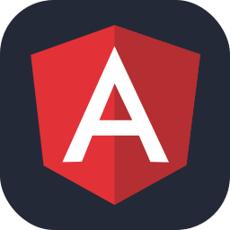

<h1 align="center">
  
</h1>

### 🚀 Hi, I'm Ahmet! (Full-Stack Developer)

Passionate about crafting user-friendly digital experiences and building scalable, performant applications. I love bridging the gap between elegant frontends and robust backends.

- 🔭 **Currently working on:** [Kind Hands](https://kind-hands.vercel.app/)
- 🌱 **Currently learning:** [Book Share (Spring Boot & Angular)](https://github.com/yavuzahmet1/book-share-springboot-angular)
- ⚡ **Focusing on:** Clean code architecture, React/Next.js ecosystems, and Spring/Node.js backends.
- 💬 **Ask me about:** JavaScript/TypeScript, Database Design (SQL/NoSQL), and Docker.

<h2 align="center">⚡ Technical Skills ⚡</h2>
<table>
  <tr>
    <td width="300"><b>Programming and Markup Languages:</b></td>
 <td>
  <table><tr>
    <td ></td>
    <td ></td>
    <td ></td>
    <td></td>
  </tr></table>
</td>
  </tr>
</table>
<table>
  <tr>
    <td  width="300"><b>Frontend Technologies:</b></td>
 <td>
  <table><tr>
    <td ></td>
    <td></td>
    <td ></td>
    <td ></td>
    <td></td>
    <td></td>
    <td></td>
  </tr></table>
</td>
  </tr>
</table>
<table>
  <tr>
    <td  width="300"><b>Backend Technologies:</b></td>
 <td>
  <table><tr>
<td ></td>
    <td ></td>
    <td ></td>
  </tr></table>
</td>
  </tr>
</table>
<table>
  <tr>
    <td  width="300"><b>Databases & ORMs:</b></td>
 <td>
  <table><tr>
    <td ></td>
    <td ></td>
    <td ></td>
    <td ></td>
    <td ></td>
    <td ></td>
     <td ></td>
  </tr></table>
</td>
  </tr>
</table>
<table>
  <tr>
    <td  width="300"><b>Operating Systems & DevOps & Deployment:</b></td>
 <td>
  <table><tr>
<td ></td>
    <td ></td>
    <td ></td>
    <td ></td>
    <td ></td>
    <td ></td>
  </tr></table>
</td>
  </tr>
</table>

<h2 align="center">⚡ Status ⚡</h2>
  

    
  

  
